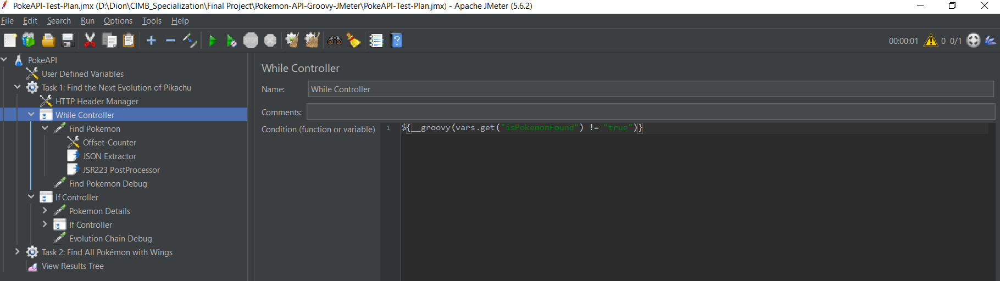
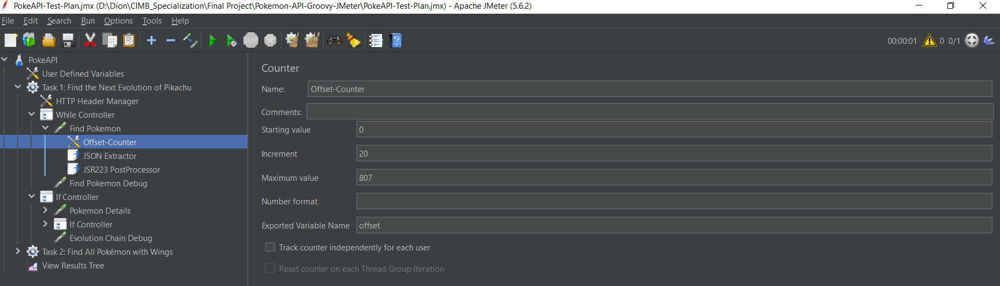
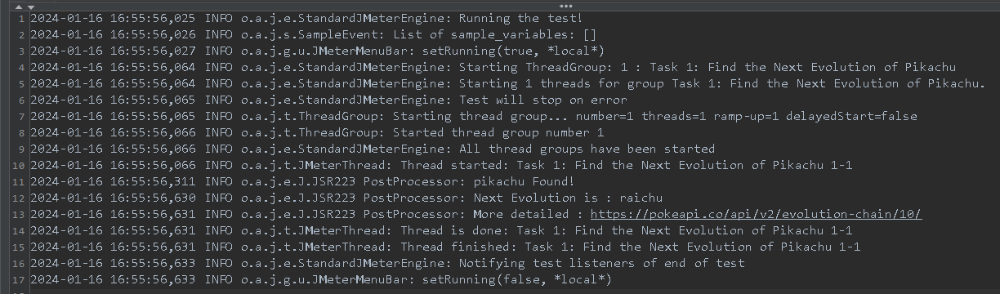
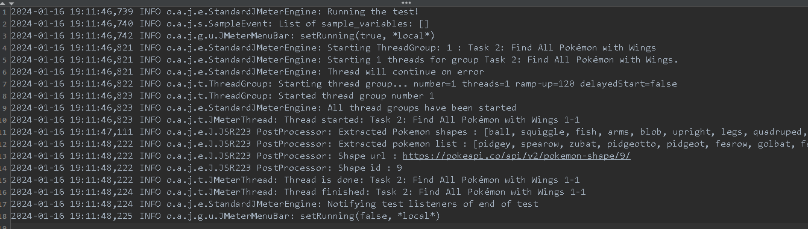

# PokeAPI JMeter Test

## Task 1 : Find the Next Evolution of Pikachu

1. Create a new test plan
2. Add new ***Thread Group***

**Perform a looped HTTP GET request to the Pokémon API to search for Pikachu's species information. Start with an offset of 0 and limit the results to 20 per request.**
1. Add new ***While Controller***
   
2. Create a counter set starting value 0 and increment 20 and store it to a variable named ***"offset"***
   

Endpoint: https://pokeapi.co/api/v2/pokemon-species?offset=0&limit=20
1. Create HTTP Request to the endpoint
2. Extract the data needed, for this case extract the JSON response with JSON Extractor by add path expression `$.results[?(@.name == 'pikachu')]`
3. Set the ***"isPokemonFound"*** variable to **"true"** so the while looping will be stopped
4. log the details of the Pokémon

## Task 2 : Find All Pokémon with Wings
<ol type="a">
 <li>
   Retrieve All Pokémon Shapes :
   <ol type="1">
      <li>Create HTTP Request to <a>https://pokeapi.co/api/v2/pokemon-shape</a></li>
      <li>Extract JSON Response that contains the results list of pokemon-shape</li>
      <li>Log the extracted result</li>
   </ol>
 </li>
 <li>
   Identify the 'Wings' Shape : 
   <ol type="1">
      <li>Log the wings id and url</li>
   </ol>
 </li>
 <li>
   Retrieve All Pokémon with the 'Wings' Shape : 
   <ol type="1">
      <li>Create HTTP Request to the 'Wings' shape url that already extracted</li>
      <l1>Extract the JSON Response to get the Pokémon name list with 'Wings' shape</l1>
      <li>Log the extracted result</li>
      
   </ol>
 </li>
</ol>
